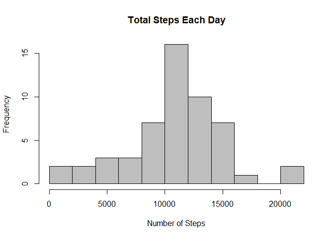
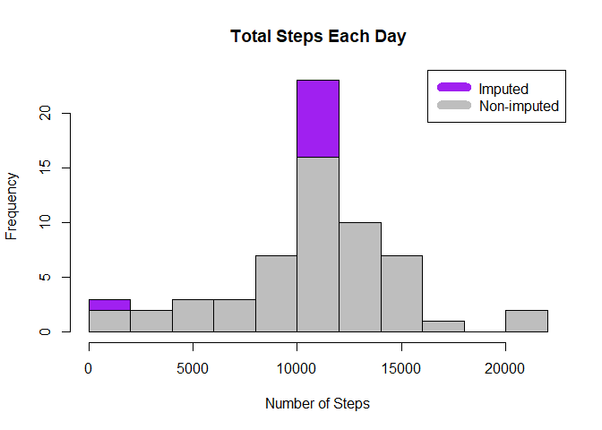

Loading and preprocessing the dataset
-------------------------------------

### 1) Loading the dataset from working directory

    if(!file.exists('activity.csv')){
            unzip('activity.zip')
    }
    data <- read.csv('activity.csv')

What is mean total number of steps taken per day?
-------------------------------------------------

### 1) Calculate the total number of steps taken per day

    steps_by_day <- aggregate(steps ~ date, data, sum)

### 2) Make a histogram of the total number of steps taken each day

    hist(steps_by_day$steps, main = paste("Total Steps Each Day"), col="gray", xlab="Number of Steps", breaks = 10)

### 3) Calculate and report the mean and median total number of steps taken per day

    rmean <- mean(steps_by_day$steps)
    rmedian <- median(steps_by_day$steps)

-   Mean: r rmean
-   Median: r rmedian

What is the average daily activity pattern?
-------------------------------------------

    steps_by_interval <- aggregate(steps ~ interval, data, mean)

### 1) Make a time series plot of the 5-minute interval (x-axis) and the average number of steps taken, averaged across all days (y-axis)

    plot(steps_by_interval$interval,steps_by_interval$steps, type="l", xlab="Interval", ylab="Number of Steps",main="Average Number of Steps per Day by Interval")

### 2) Which 5-minute interval, on average across all the days in the dataset, contains the maximum number of steps?

    max_interval <- steps_by_interval[which.max(steps_by_interval$steps),1]

-   Most steps at: r max\_intervals

Imputing missing values
-----------------------

### 1) Calculate and report the total number of missing values in the dataset

    incomplete <- sum(!complete.cases(data))

-   Number of missing values: r incomplete

### 2) Devise a strategy for filling in all of the missing values in the dataset.

### 3) Create a new dataset that is equal to the original dataset but with the missing data filled in.

    imputed_data <- transform(data, steps = ifelse(is.na(data$steps), steps_by_interval$steps[match(data$interval, steps_by_interval$interval)], data$steps))
    imputed_data[as.character(imputed_data$date) == "2012-10-01", 1] <- 0

### 4) Make a histogram of the total number of steps taken each day

    steps_by_day_i <- aggregate(steps ~ date, imputed_data, sum)
    hist(steps_by_day_i$steps, main = paste("Total Steps Each Day"), col="purple", xlab="Number of Steps", breaks = 10)

    # Histogram to show differences
    hist(steps_by_day$steps, main = paste("Total Steps Each Day"), col="gray", xlab="Number of Steps", add=T, breaks = 10)
    legend("topright", c("Imputed", "Non-imputed"), col=c("purple", "gray"), lwd=10)

### 5) Calcuulate and report the mean and median total number of steps taken in a day

    rmean.i <- mean(steps_by_day_i$steps)
    rmedian.i <- median(steps_by_day_i$steps)

-   Mean (Imputed): r rmean.i
-   Medain (Imputed): r rmedian.i

Are there differences in activity patterns between weekdays and weekends?
-------------------------------------------------------------------------

### 1) Create a new factor variable in the dataset with two levels – “weekday” and “weekend” indicating whether a given date is a weekday or weekend day.

    weekdays <- c("Monday", "Tuesday", "Wednesday", "Thursday", 
                  "Friday")
    imputed_data$dow = as.factor(ifelse(is.element(weekdays(as.Date(imputed_data$date)),weekdays), "Weekday", "Weekend"))

    steps_by_interval_i <- aggregate(steps ~ interval + dow, imputed_data, mean)

### 2) Make a panel plot containing a time series plot

    library(lattice)

    xyplot(steps_by_interval_i$steps ~ steps_by_interval_i$interval|steps_by_interval_i$dow, main="Average Steps per Day by Interval",xlab="Interval", ylab="Steps",layout=c(1,2), type="l")

